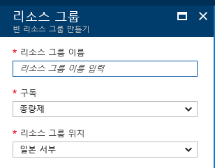
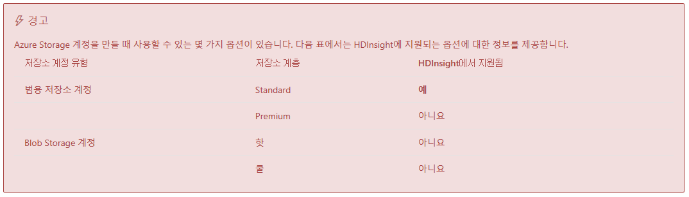
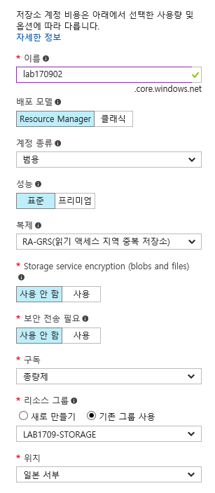
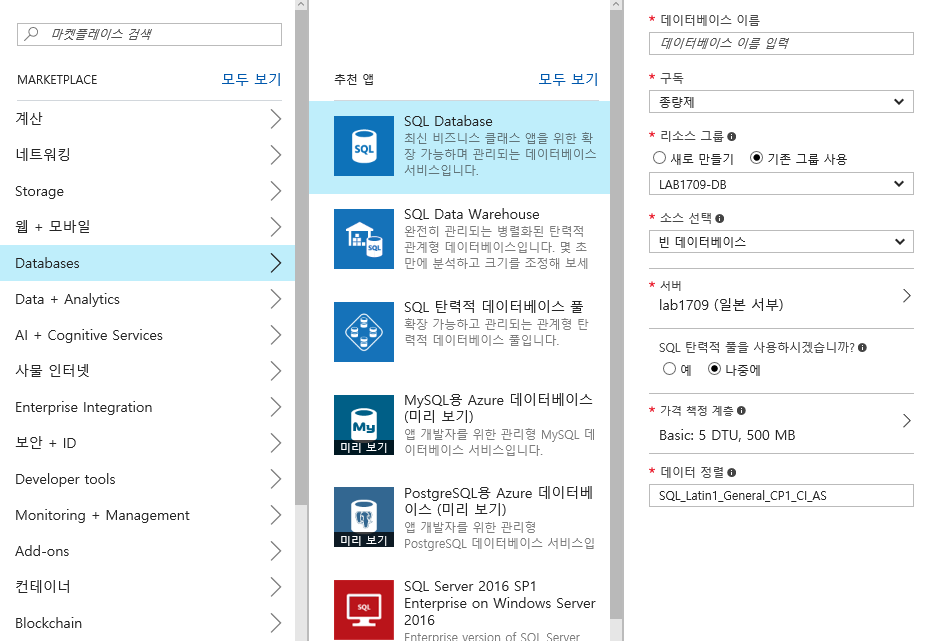
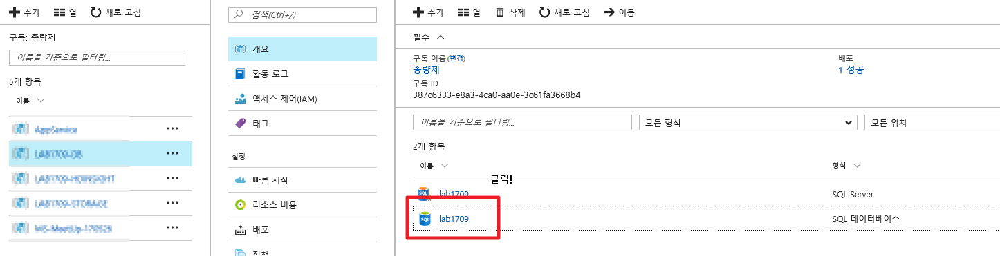
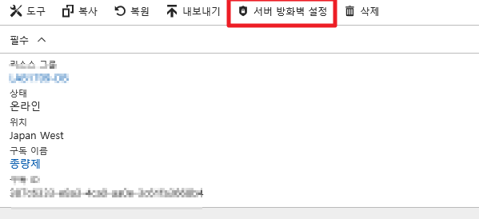
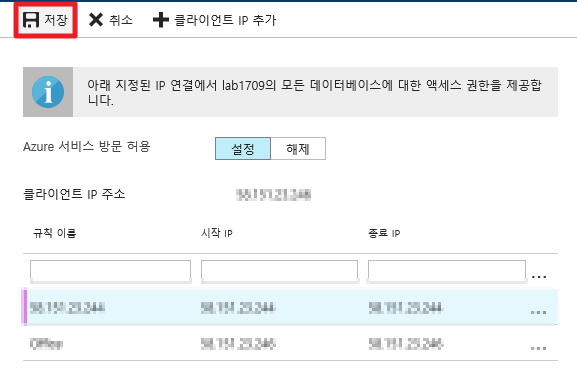
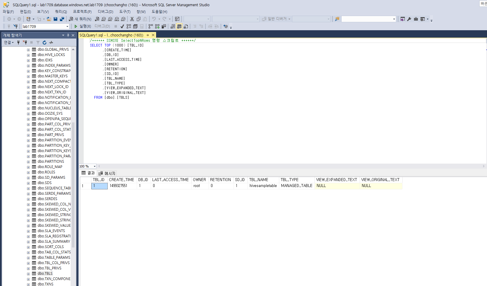

# HDInsight 클러스터 만들기

> HDInsight 클러스터는 중지할 수 없고 삭제하여야 한다.

> 저장된 데이터(hive 메타데이터등)를 유지하기 위해서는 외부 Database(SQL Database)와 저장소 계정을 이용하여야 한다.

## 1. 리소스 그룹

실습이 종료되면 생성된 리소스를 삭제하기 편하므로 별도의 리소스 그룹을 만든다.

## 2. 저장소

HDInsight 에 호환되는 Azure Storage 는 아래와 같다.

https://docs.microsoft.com/ko-kr/azure/hdinsight/hdinsight-hadoop-use-blob-storage

저장소 계정 만들기 예

## 3. SQL Database

### 만들기

### 서버방화벽 설정

### SQL Server Management Studio

[다운로드](https://docs.microsoft.com/ko-kr/sql/ssms/download-sql-server-management-studio-ssms)

### 접속하기

<database 이름>.database.windows.net

